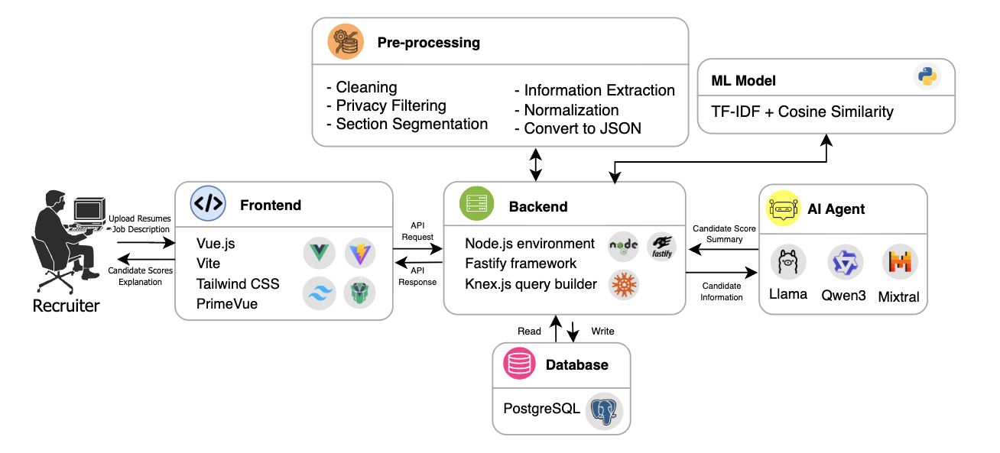

# CoHR
LLM as a decision-support or second-review assistant for resume screening

## 1. Introduction
HR (human resources) professionals handle numerous daily tasks and act as gatekeepers in recruitment, deciding which candidates advance to the next stage. However, this process presents challenges: reviewing full resumes is time-consuming, and HR often manages diverse roles they may not fully understand, making accurate evaluation difficult. For instance, an HR professional may lack familiarity with the required skills for a Field Application Engineer but still must decide whether to invite the candidate for a phone interview. Therefore, our objective is to use LLMs to support more efficient and effective resume screening decisions.

## 2. Dataset Information

## 3. Environment Setup
### File Structure
```

```

## 4. Model Framework
### 4.1. Outline of the architecture


## 5. Results

## 6. Demo Video

## Reference