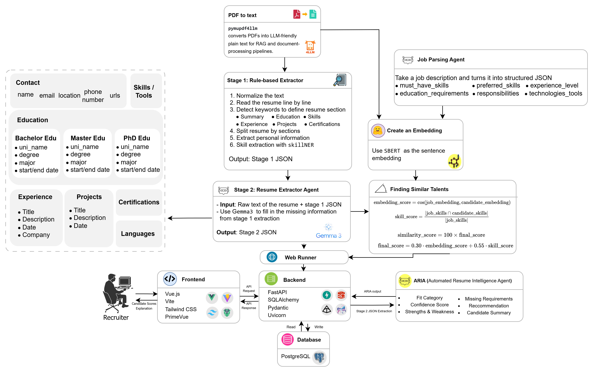

<div align="center">
  <h1 align="center">CoHR: AI-Powered Resume Screening Assistant</h1>
  <p align="center">
    A sophisticated decision-support system to assist HR professionals in resume screening, leveraging a multi-stage pipeline of rule-based parsing, LLM-based analysis, and semantic scoring.
  </p>
</div>

<p align="center">
  
  
  
  
  
</p>

## 1. Introduction

CoHR is designed to act as a second-review assistant for Human Resources professionals. The traditional resume screening process is often time-consuming and challenging, especially when recruiters must evaluate candidates for highly specialized roles they may not fully understand. CoHR addresses this by automating the analysis of resumes against job descriptions, providing both quantitative scores and qualitative insights.

This system uses a powerful pipeline that begins with parsing a PDF resume, extracting structured data through a hybrid rule-based and LLM-powered approach, and scoring it against a parsed job description. The result is a comprehensive analysis presented in a clean, modern web interface, enabling recruiters to make faster, more informed decisions.

## ✨ Key Features

*   ⚙️ **Dual-Stage Resume Parsing:** Combines a high-speed, rule-based extractor with a sophisticated LLM agent (Gemma) for fast and accurate data extraction.
*   🧠 **Semantic Similarity Scoring:** Goes beyond keywords by using SBERT embeddings to calculate a nuanced score reflecting the contextual fit between a candidate and a job.
*   🤖 **AI-Powered Qualitative Analysis (ARIA):** An intelligent agent provides a candidate summary, strengths, weaknesses, and a final hiring recommendation.
*   📄 **Structured Data Extraction:** Intelligently parses both resumes and job descriptions into structured JSON, enabling precise, field-by-field comparisons.
*   🌐 **Integrated Full-Stack Application:** A complete and user-friendly tool for HR professionals, built with a modern Vue.js frontend and a robust FastAPI backend.

## 🏗️ Architecture

The system is designed as a multi-stage processing pipeline that takes a resume and job description and produces a detailed analysis for the recruiter.



## 🛠️ Tech Stack

| Category      | Technology                                                                                                                                                           |
|---------------|----------------------------------------------------------------------------------------------------------------------------------------------------------------------|
| **Frontend**  |     |
| **Backend**   |    |
| **AI/ML**     |   |
| **Database**  |                                           |

## 🚀 Getting Started

Follow these steps to get the development environment running.

### 1. Prerequisites

*   Node.js and npm
*   Python 3.11+ and pip
*   Conda or `venv` for virtual environment management
*   A running PostgreSQL instance

### 2. Backend Setup

First, navigate to the backend directory, create and activate a virtual environment, and install the required Python packages.

```bash
# 1. Go to the backend directory
cd back-end

# 2. Create and activate a virtual environment (example with conda)
conda create -n cohr python=3.11 -y
conda activate cohr

# 3. Install dependencies
pip install -r requirements.txt
```

### 3. Frontend Setup

In a separate terminal, navigate to the frontend directory and install the npm packages.

```bash
# 1. Go to the frontend directory
cd front-end

# 2. Install dependencies
npm install
npm update
```

### 4. Running the Application

You need to run both the backend and frontend servers simultaneously in their respective terminals.

**Start the Backend Server (FastAPI):**

```bash
# From the back-end/ directory
uvicorn main:app --reload --port 8080
```

**Start the Frontend Server (Vue):**

```bash
# From the front-end/ directory
npm run dev
```

The application should now be accessible at `http://localhost:5173` (or whichever port Vite assigns).

## 📄 License

This project is licensed under the MIT License. See the `LICENSE` file for details.